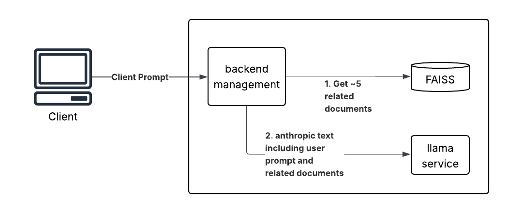

# DocumentIntelligencePOC

## Repo Summary
Given the recent surge of AI ideas, here's a repo meant to aid a POC implementation for a "Document Intelligence Bot."  This architecture may also prove to work well with other use cases as noted in the [AI / ML Use Case Challenge – Results](https://epsiloncs.atlassian.net/wiki/spaces/AI/pages/2494136322/AI+ML+Use+Case+Challenge+Results).

I've thought about this for a few months now but due to work obligations I haven't been able to spend much time on it other than consider architectural concepts.

This would be most efficiently implemented as a RAG system, using an in memory information retrieval system for fast context, and ollama for a local instance of LLM.  This means we won't have to commit resources to costly training, and we shouldn't have security concerns due to its local nature.

The general architecture is as follows:

## Simple instructions
### RAG data:
For this architecture, we'll need document data to load into our FAISS similarity search engine.  Since we don't yet want to use Epsilon IP, it would be smart to instead use something we work with regularly and is grossly confusing, such as oracle db.  Here's a quick link I found with some pdf resources: https://docs.oracle.com/en/database/oracle/oracle-database/21/books.html

The important––and perhaps most annoying––thing here, is that we need small enough single documents to sift through so that we aren't sending ridiculously huge anthropic prompts to the LLM, but large enough that they are still individually useful.  I suggest dividing them up by sections (not entire chapters).

### Backend mangement service
You need something to take in the general client prompt, manage requesting similar documents from your in-memery data storage, and then sending a cumulative anthropic prompt to the LLM and piping the response back to the client.  I suggest creating a simple python file since this would also be the simplest technology to implement a slim webservice.

### Llama
Using the Ollama interface for ease, I suggest using Deepseek as it is notoriously slimmer than other models while still achieving similar success rates on various measures.  The model selected will be an important and deciding factor given the limited resources of this project.

### UI
Though unnecessary, it would be neat to implement a chatgpt like interface, and should be simple enough given the open source resources for such things (see chatbot-ui in the resources section).

## Resources
- [FAISS](https://github.com/facebookresearch/faiss)
- [Ollama](https://ollama.com/)
- [Deepseek model](https://ollama.com/library/deepseek-r1)
- [chatbot-ui](https://github.com/mckaywrigley/chatbot-ui)